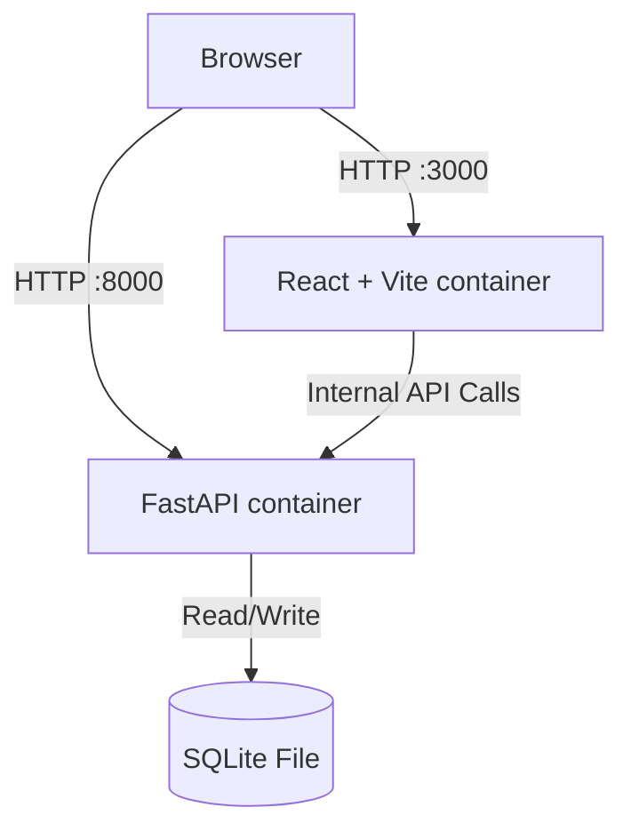

# PostMaster

PostMaster is a social media management platform MVP designed for self-hosting. It features a React frontend and a FastAPI backend, orchestrated via Docker Compose.

## 🏗 Architecture



- **Frontend**: React, TypeScript, Tailwind CSS, Recharts.
- **Backend**: FastAPI, SQLAlchemy, Pydantic.
- **Database**: SQLite (persisted in `./data` volume).
- **Deployment**: Docker Compose.

## 🚀 Setup & Installation

### Prerequisites
- Docker & Docker Compose installed on your machine.
- Ports `3000` and `8000` available.

### Steps
1. Clone the repository.
2. Create the data directory (optional, docker handles it usually, but good practice):
   ```bash
   mkdir -p data
   ```
3. Run the application:
   ```bash
   docker-compose up
   ```
   *Note: The first run will take a few minutes as it installs Python dependencies and Node modules inside the containers.*

4. Access the application:
   - **Frontend**: [http://localhost:3000](http://localhost:3000)
   - **Backend API Docs**: [http://localhost:8000/docs](http://localhost:8000/docs)

## 🧪 Testing

### Mock Mode
If the backend container is not running or unreachable, the frontend will automatically switch to **Mock Mode**. A banner will appear at the top of the UI indicating this state.

### API Testing
You can test the API directly using the auto-generated Swagger UI at `http://localhost:8000/docs`.

**Example: Create a Post**
POST `/posts`
```json
{
  "content": "Hello World!",
  "platforms": ["twitter", "linkedin"],
  "scheduled_at": null
}
```

## 🔧 Troubleshooting

**Frontend fails to connect to backend:**
- Ensure `VITE_API_URL` is set correctly in `.env` or `docker-compose.yml`.
- Check CORS settings in `backend/main.py`.
- Verify the backend container is healthy: `docker ps`.

**Permission errors on Linux:**
- You might need to adjust permissions for the `./data` folder or `./frontend` folder if Docker writes files as root.

## 🌐 Nginx Deployment

To deploy behind an external Nginx proxy:

```nginx
server {
    listen 80;
    server_name postmaster.yourdomain.com;

    location / {
        proxy_pass http://localhost:3000;
        proxy_set_header Host $host;
        proxy_set_header X-Real-IP $remote_addr;
    }

    location /api/ {
        # Assuming you prefix backend routes or run on a subdomain api.postmaster.yourdomain.com
        proxy_pass http://localhost:8000/;
        proxy_set_header Host $host;
    }
}
```
